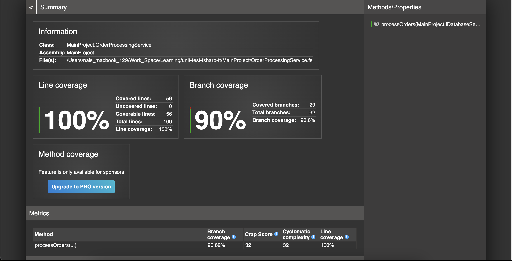

# TestProject

This project contains unit tests for the `OrderProcessingService` in the `MainProject`. The tests are written in F# using `xUnit` and `Moq`.

## Prerequisites
- Dotnet cli
- Docker installed on your machine
- Docker Compose installed (optional, for `docker-compose` usage)


## Using dotnet cli
1. Run unit test
``` bash
▶ dotnet test --collect:"XPlat Code Coverage"
```

2. Generate report
``` bash
dotnet tool install -g dotnet-reportgenerator-globaltool

reportgenerator \  -reports:"TestResults/**/coverage.cobertura.xml" \
  -targetdir:"coveragereport" \
  -reporttypes:Html
```

## Build and Run Tests in Docker
### Using Docker

1. Build the Docker image:
   ```bash
   docker build -t testproject .
   ```

2. Run the tests:
   ```bash
   docker run --rm -v $(pwd)/TestResults:/app/TestResults testproject
   ```

   The test results and code coverage reports will be available in the `TestResults` directory.

### Using Docker Compose

1. Run the tests:
   ```bash
   docker-compose up --build
   ```

2. The test results and code coverage reports will be available in the `TestResults` directory.

## Test Results and Coverage

- Test results are generated in the `TRX` format.
- Code coverage reports are generated in the `XPlat Code Coverage` format.

To convert the coverage report to a readable format (e.g., HTML), you can use the `reportgenerator` tool:

```bash
dotnet tool install -g dotnet-reportgenerator-globaltool
reportgenerator -reports:/TestResults/*/coverage.cobertura.xml -targetdir:coverage-report
```

The HTML report will be available in the `coverage-report` directory.

---

## Test Cases

Here are the test cases implemented for the `OrderProcessingService`:

### Type A Orders
1. **Successful Export**  
   - Input: Order with `Type = "A"`, `Amount = 100.0`
   - Expected: Status updated to `"exported"`.

2. **High Value Export**  
   - Input: Order with `Type = "A"`, `Amount = 200.0`
   - Expected: Status updated to `"exported"`, Priority set to `"high"`.

3. **Export Failure**  
   - Input: Order with `Type = "A"`, IOException during file write.
   - Expected: Status updated to `"export_failed"`.

### Type B Orders
1. **Successful API Call**  
   - Input: Order with `Type = "B"`, API returns `Data >= 50`.
   - Expected: Status updated to `"processed"`.

2. **API Failure**  
   - Input: Order with `Type = "B"`, API throws an exception.
   - Expected: Status updated to `"api_failure"`.

3. **Error Status**  
   - Input: Order with `Type = "B"`, API returns `Status = "failed"`.
   - Expected: Status updated to `"api_error"`.

### Type C Orders
1. **Flag True**  
   - Input: Order with `Type = "C"`, `Flag = true`.
   - Expected: Status updated to `"completed"`.

2. **Flag False**  
   - Input: Order with `Type = "C"`, `Flag = false`.
   - Expected: Status updated to `"in_progress"`.

### Unknown Orders
1. **Unknown Type**  
   - Input: Order with `Type = "D"`.
   - Expected: Status updated to `"unknown_type"`.

### Exception Handling
1. **Database Exception**  
   - Input: Database throws an exception during status update.
   - Expected: Exception handled gracefully, process continues.

2. **Outer Exception**  
   - Input: Unexpected exception during order processing.
   - Expected: Returns `false`.

---

## Test Results



